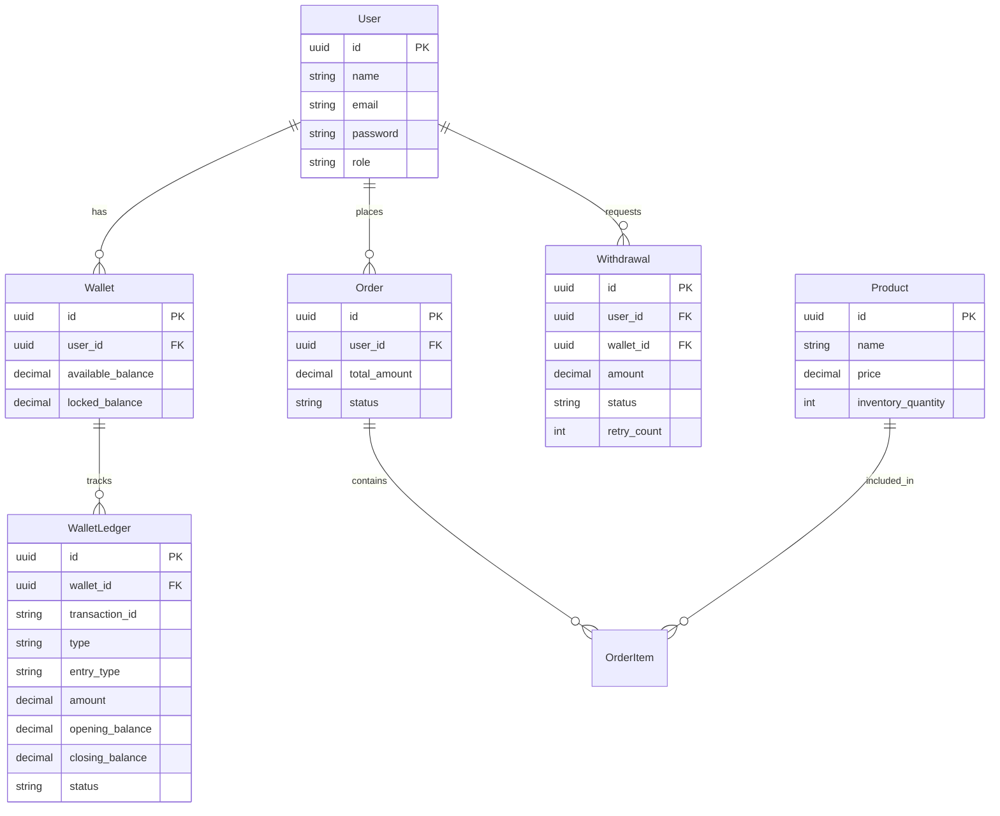

# Fintech Wallet & Order Processing System

A backend system built with Node.js (Express), MySQL (Sequelize), and Redis (BullMQ) to handle wallet operations, product orders, and asynchronous withdrawal processing.

---

## Tech Stack
- **Runtime & Framework**: Node.js, Express
- **Database & ORM**: MySQL 8.0, Sequelize ORM
- **Queue / Background Jobs**: Redis 7, BullMQ
- **Validation & Auth**: Zod, JSON Web Tokens (JWT), bcryptjs
- **Logging**: Winston, Morgan

---

## Key Design Decisions & Features

### 1. Concurrency & Race Condition Prevention
To prevent double-spending and overselling, all balance and stock updates run inside database transactions with row-level locks (`SELECT FOR UPDATE` via `lock: t.LOCK.UPDATE` in Sequelize):
- **Wallet Operations**: Top-ups and checkouts lock the user's wallet row before modifying `availableBalance` or `lockedBalance`.
- **Order Checkout**: Product rows are sorted deterministically (by product ID) and locked before deducting stock to prevent deadlocks and overselling during simultaneous requests.
- **Rollback Safety**: If any product lacks inventory or the wallet has insufficient funds, the entire transaction is rolled back.

### 2. Double-Entry Wallet Ledger
Every balance change writes an immutable audit record to `WalletLedgers`:
- Stores transaction ID, reference entity (order ID, withdrawal ID, top-up ID), entry type (`CREDIT` / `DEBIT`), opening balance, and closing balance.
- Enables a full audit trail and balance reconciliation (`GET /api/admin/reconciliation`).

### 3. Idempotency Support
Endpoints that mutate financial state (`/api/wallet/topup`, `/api/orders`, `/api/withdrawals`) support an optional `Idempotency-Key` header:
- Stores the request hash and response in the database.
- If a client retries with the same key within 24 hours, the server returns the cached response directly without re-executing the transaction.

### 4. Asynchronous Withdrawal Flow
Withdrawals use a 2-phase process:
1. **Hold Funds**: When requested, money moves immediately from `availableBalance` to `lockedBalance` and a `PENDING` record is created.
2. **Background Queue Processing**: BullMQ picks up the job with retry logic (up to 3 attempts with exponential backoff).
3. **Settlement / Failure**:
   - On success: `lockedBalance` is deducted and status becomes `PROCESSED`.
   - On failure (retries exhausted) or admin rejection: The locked amount is refunded back to `availableBalance` and logged as `WITHDRAWAL_REVERSED`.

---

## Database Design



---

## Getting Started

### 1. Start Services via Docker
```bash
docker compose up -d mysql redis
```

### 2. Run Database Migrations
```bash
npm run db:migrate
```

### 3. Run Tests
```bash
npm test
```

### 4. Start Development Server
```bash
npm run dev
```

The application runs on `http://localhost:7000`.

---

## API Reference Summary

| Category | Method | Endpoint | Description | Idempotent |
| :--- | :--- | :--- | :--- | :---: |
| **Auth** | `POST` | `/api/auth/register` | Register new user + wallet | No |
| **Auth** | `POST` | `/api/auth/login` | Login and obtain JWT token | No |
| **Auth** | `GET` | `/api/auth/profile` | View authenticated profile | No |
| **Wallet** | `GET` | `/api/wallet/balance` | Get available & locked balance | No |
| **Wallet** | `POST` | `/api/wallet/topup` | Credit money to wallet | **Yes** |
| **Wallet** | `GET` | `/api/wallet/statement` | Paginated double-entry ledger | No |
| **Products** | `GET` | `/api/products` | List product catalog | No |
| **Products** | `POST` | `/api/products` | Create product (Admin) | No |
| **Orders** | `POST` | `/api/orders` | Place order with stock locking | **Yes** |
| **Orders** | `GET` | `/api/orders/:id` | Get order details | No |
| **Orders** | `POST` | `/api/orders/:id/cancel` | Cancel order & refund to wallet | No |
| **Withdrawals**| `POST` | `/api/withdrawals` | 2-phase locked withdrawal | **Yes** |
| **Withdrawals**| `GET` | `/api/withdrawals/my` | List user withdrawals | No |
| **Admin** | `GET` | `/api/admin/withdrawals/pending` | View pending settlement queue | No |
| **Admin** | `POST` | `/api/admin/withdrawals/:id/approve` | Settle withdrawal | No |
| **Admin** | `POST` | `/api/admin/withdrawals/:id/reject` | Reject & refund locked balance | No |
| **Admin** | `GET` | `/api/admin/reports` | Platform metrics & volume | No |
| **Admin** | `GET` | `/api/admin/reconciliation` | Full ledger vs balance audit | No |

---

## Postman Collection
A complete Postman collection is included in [`ss_task_postman_collection.json`](./ss_task_postman_collection.json).
